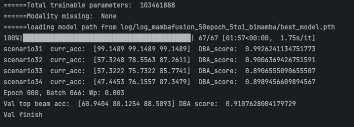
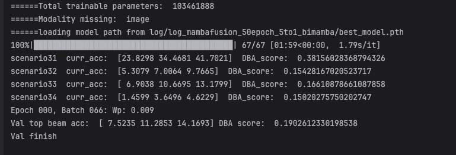
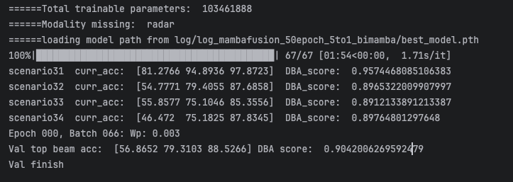
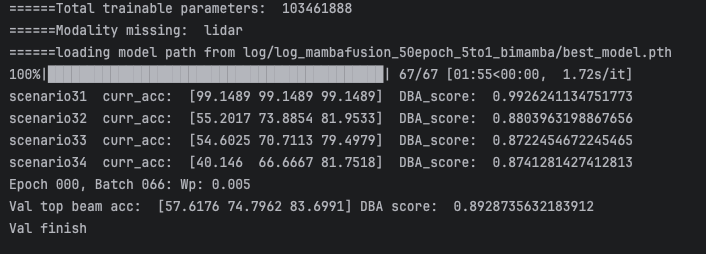
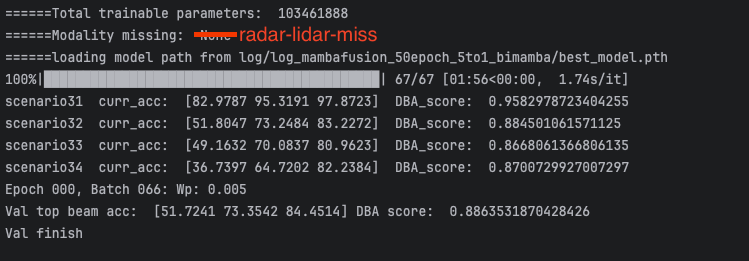

# DeepSense6G_TII的复现
## Step 1
配置虚拟环境：
* env_name: `deepsense`
* env_path: `/data/szy4017/miniconda3/envs/deepsense`
* dataset_path = `/data/share/dataset/DeepSense6G`

## Step 2
模型训练
* checkpoint for best_model.pth: 原作者给了下载链接，但是没法下载，已经在GitHub上提了issue
* epoch: 150
* batch: 2392, 1.3s for one batch
* batch_size: 6
* GPU memory: 4.5+3.8+3.8+3.8+3.8+3.8=23.5G for 6 GPUs
* train_time: 1.2\*2392\*150=430560s=120h for 6 GPUs

retrain base model
* batch_size: 24
* GPU memory: 10*6=60G for 6 GPUs
* train_time: 8min\*150=1200min=20h

train mamba modal
* batch_size: 24
* GPU memory: 5\*6=30G for 6 GPUs
* train_time: 14min\*30=420min=7h

train bimamba modal
```
python train2_seq.py --epochs 50 --batch_size 24
```
* batch_size: 24
* GPU memory: 7\*6=42G for 6 GPUs
* Params: 103MB
* train_time: 14min\*50=420=7h
* dataset split: trainval=adaset+devset, train:val=9:1

## 实验中的问题
### Problem 1
使用mamba替换transformer进行20to5的多步预测是，模型训练在前期（第4个epoch）就出现梯度爆炸（loss=NaN）。

### Solution (1)
使用梯度裁剪，并减小学习率
* torch.nn.utils.clip_grad_norm_(model.parameters(), max_norm=5.0)
* lr: 5e-4 -> 1e-4
```
python train2_seq_30to5.py --epochs 50 --batch_size 12 --lr 1e-4
```
结果：训练到第7个epoch依然出现梯度爆炸（loss=NaN）。

### Solution (2)
设置更短的history(10to5)，也匹配baseline的设定
```
python train2_seq_30to5.py --epochs 50 --batch_size 12 --lr 1e-4
```
结果：训练到第6个epoch依然出现梯度爆炸（loss=NaN）。

### Solution (3)
在mambafusion中采用双边mamba编码
* self.ln1 = nn.LayerNorm(ln_size)
* x_fused = torch.add(torch.mul(x_bm, x_relu), torch.mul(x_fm, x_bm))
* torch.nn.utils.clip_grad_norm_(model.parameters(), max_norm=5.0)
```
python train2_seq_30to5.py --epochs 50 --batch_size 12 --lr 1e-4
```
结果：解决梯度爆炸问题，loss正常下降且性能稳定，best_DBA_score_scenario_all=0.9142 > 0.4671 (baseline)

# TODO
## missing modality rebuild
1. 测试baseline: upper limit->multi-training and inference; lower limit->multi-training and missing inference;
2. 基于SimMMDG构建modality rebuild模块，实现对missing modality的生成;
3. 主要参考指标 DBA_score_val_scenario_all
```
python train2_seq.py --batch_size 24 --Val 1 --modality_missing image --loda_model_path log/log_mambafusion_50epoch_5to1_bimamba/best_model.pth
```

| model | upper  | image-rebuild | lower-image-miss | radar-rebuild | lower-radar-miss | lidar-rebuild | lower-lidar-miss | radar-lidar-rebuild | lower-radar-lidar-miss |
|-------|--------|---------------|------------------|---------------|------------------|---------------|------------------|---------------------|------------------------|
| mamba | 0.9108 |               | 0.1903           |               | 0.9042           |               | 0.8929           |                     | 0.8864                 |
log_path: log/log_mambafusion_50epoch_5to1_bimamba/best_model.pth

Metrics on no missing


Metrics on image missing


Metrics on radar missing


Metrics on lidar missing


Metrics on radar and lidar missing


## modality rebuild module
1. 模态的特征提取采用原有结构: ImageEncoder, RadarEncoder, LidarEncoder;
2. FusionEncoder用于融合特征预测beam;
3. FeatureTrans用于将source modality向target modality转换;
4. loss_total = loss_pred + loss_trans + loss_contrast + loss_distance
```
export PYTHONPATH=$PYTHONPATH:/data/szy4017/code/DeepSense6G_TII
CUDA_VISIBLE_DEVICES=0,1,2 python train_image_radar_lidar_rebuild.py -s image radar -t lidar --lr 1e-3 --epochs 30 --batch_size 24
```

## 实验中的问题
### Problem 1
损失下降比较慢，30epoch loss_total (14.5->7.6)，预测性能表现也很差，0.3756（训练时多模态融合的预测性能），
在推理时应该用source+rebuild进行融合的预测性能。
```
python train_image_radar_lidar_rebuild.py -s image radar -t lidar --epochs 30 --batch_size 24
```

### Solution (1)
调整学习率
* lr: 1e-4 -> 1e-3 or 5e-4
```
python train_image_radar_lidar_rebuild.py -s image radar -t lidar --lr 5e-4 --epochs 30 --batch_size 24
```
结果：效果不明显，调大lr，loss开始震荡

### Solution (2)
采用mambafusion里面的encoder参数作为预训练参数
```
CUDA_VISIBLE_DEVICES=3,4,5 python train_image_radar_lidar_rebuild.py -s image radar -t lidar --epochs 30 --batch_size 24
```
结果：训练依然不收敛，DBA_score_train=0.2376<0.3756(baseline)，
观察loss变化：loss_pred=12->6; loss_trans=1.4->1.4; loss_contrast=6.1->5; loss_distance=0->-1.3
loss_pred的误差太大，loss_trans没有得到有效训练

### Solution (3)
用mambafusion的frozen参数直接进行融合的预测，不用loss_pred，重点训练FeatureTrans模块。
```
python train_image_radar_lidar_rebuild.py -s image radar -t lidar --epochs 30 --batch_size 24 --lr 1e-3
```
结果：loss几乎不下降，无法有效训练，loss_contrast=12.0；loss_trans=1.0；loss_distance=0.0

### Solution (4)
调整多个loss的权重，对于对比学习的loss_contrast，需要解决正负样本不均衡的问题，用batch_size=2试一试，进一步需要把label引入到对比损失计算中
把源域改成lidar和radar，目标域改成image
* batch_size: 2
* alpha_contrast: 0.5
* alpha_trans: 5.0
* alpha_distance: 2.0
* s: lidar radar, t: image
```
python train_image_radar_lidar_rebuild.py -s lidar radar -t image --batch_size 2 --epoch 30 --alpha_contrast 0.5 --alpha_trans 5.0 --alpha_distance 2.0
```
结果：batch_size=2可以帮助损失下降加快，loss_contrast=8.8->1.1，loss_trans=1.0->0.5，loss_diatance=0.0(可能是前期变化不大)

### Solution (5)
增加validate过程
```
python train_image_radar_lidar_rebuild.py -s lidar radar -t image --batch_size 2 --epoch 30 --alpha_contrast 0.5 --alpha_trans 5.0 --alpha_distance 2.0 --modality_missing image
```

### Commands
tensorboard --logdir log --host=10.15.198.46 --port=6008
python train2_seq.py --epochs 30 --batch_size 24 --logdir 'log/20240619_165326'

